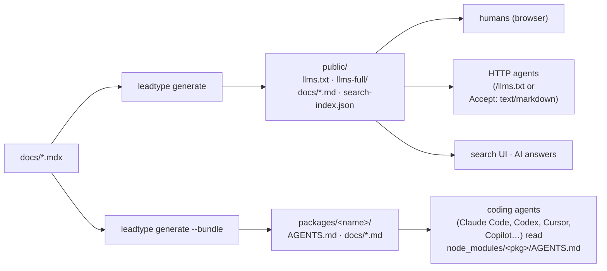

# leadtype

A docs pipeline. Write MDX once. Get a website for humans, an `llms.txt` for HTTP agents, an `AGENTS.md`-fronted bundle for offline coding agents, and a static search index — all from a single source.



leadtype is **not a docs website framework**. Bring your own UI — Next.js, TanStack Start, Astro, anything — and let leadtype handle conversion, validation, search, and the agent-facing outputs that website frameworks don't ship.

## Choose your path

- **[Build a docs site](https://docs.example.com/docs/build/connect-docs-site)** — wire leadtype into your build to convert MDX, index search, and serve markdown to agents.
- **[Bundle docs into your package](https://docs.example.com/docs/build/bundle-package-docs)** — ship `AGENTS.md` plus topic markdown inside the npm tarball so coding agents auto-discover them from `node_modules/<your-package>/AGENTS.md`.

## Install

```bash
pnpm add leadtype
```

## 30-second example

For a hosted docs site:

```bash
npx leadtype generate --src . --out public --base-url https://docs.example.com
```

For an npm-bundled doc set:

```bash
npx leadtype generate --bundle --src . --out packages/my-package
```

The first produces `public/llms.txt`, `public/docs/llms-full/*.txt`, `public/docs/search-index.json`, and `public/docs/*.md`. The second produces `packages/my-package/AGENTS.md` and `packages/my-package/docs/*.md` — auto-discoverable by [25+ coding agents](https://agents.md) once the package is installed.

## Documentation

Full docs at [docs.example.com](https://docs.example.com/docs):

- [Quickstart](https://docs.example.com/docs/quickstart)
- [How it works](https://docs.example.com/docs/how-it-works)
- [Frontmatter](https://docs.example.com/docs/authoring/frontmatter)
- [CLI reference](https://docs.example.com/docs/reference/cli)
- [Methodology](https://docs.example.com/docs/methodology) — how leadtype differs from Fumadocs, Starlight, and Mintlify

## Repo layout

- `packages/leadtype/` — the npm package (CLI + library entry points).
- `apps/example/` — production docs site and reference template, on TanStack Start.
- `docs/` — the source MDX rendered by both this site and the package's bundled docs.

## Local workflow

```bash
bun install
bun run dev          # build the package, run the pipeline, start the example app
```

Pipeline checks:

```bash
bun run --filter example pipeline:build
bun run --filter example pipeline:test
bun run --filter example test:e2e
```

## License

MIT.
