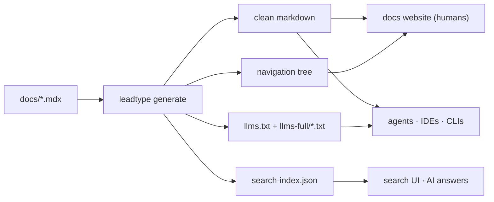

# leadtype

A docs pipeline. Write MDX once. Get a website, agent-readable bundles, and a static search index from a single command.



leadtype is **not a docs website framework**. Bring your own UI — Next.js, TanStack Start, Astro, anything — and let leadtype handle conversion, validation, search, and the agent-facing outputs that website frameworks don't ship.

## Choose your path

- **[Build a docs site](https://docs.example.com/docs/build/connect-docs-site)** — wire leadtype into your build to convert MDX, index search, and serve markdown to agents.
- **[Bundle docs into your package](https://docs.example.com/docs/build/bundle-package-docs)** — ship agent-readable docs inside the npm tarball so IDEs and coding agents can read them offline.

## Install

```bash
pnpm add leadtype
```

## 30-second example

```bash
# In a repo with docs/*.mdx
npx leadtype generate --src . --out public --base-url https://docs.example.com
```

This converts every `.mdx` under `docs/`, writes `public/llms.txt` plus per-leaf `public/docs/llms-full/*.txt`, builds `public/docs/search-index.json`, and resolves the navigation tree.

See [`apps/example/`](./apps/example) for the canonical docs-site setup, including content negotiation that serves markdown to agents on the same URL humans visit. See [`packages/leadtype/scripts/generate-docs.ts`](./packages/leadtype/scripts/generate-docs.ts) for the canonical "bundle docs into a package" pattern.

## Documentation

Full docs at [docs.example.com](https://docs.example.com/docs):

- [Quickstart](https://docs.example.com/docs/quickstart)
- [How it works](https://docs.example.com/docs/how-it-works)
- [Frontmatter](https://docs.example.com/docs/authoring/frontmatter)
- [CLI reference](https://docs.example.com/docs/reference/cli)
- [Methodology](https://docs.example.com/docs/methodology) — how leadtype differs from Fumadocs, Starlight, and Mintlify

## Repo layout

- `packages/leadtype/` — the npm package (CLI + library entry points).
- `apps/example/` — production docs site and reference template, on TanStack Start.
- `docs/` — the source MDX rendered by both this site and the package's bundled docs.

## Local workflow

```bash
bun install
bun run dev          # build the package, run the pipeline, start the example app
```

Pipeline checks:

```bash
bun run --filter example pipeline:build
bun run --filter example pipeline:test
bun run --filter example test:e2e
```

## License

MIT.
